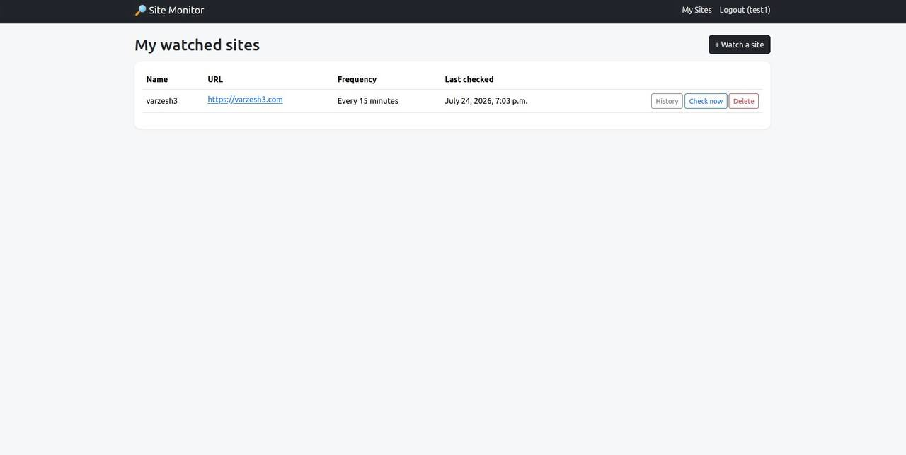
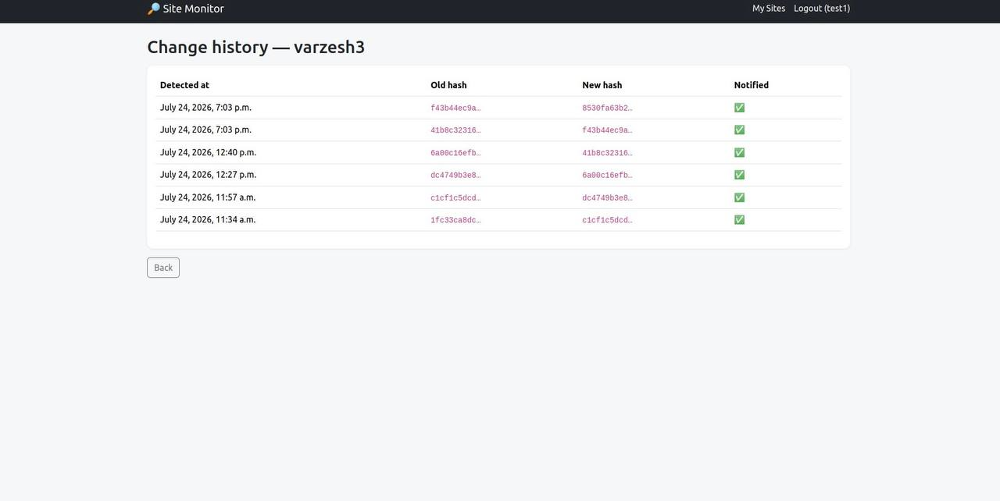

# 🔎 Website Change Monitor

Watch any webpage (like the IND visa page, or a company's careers page) and
get an email the moment its content changes. Built with Django + Celery to
demonstrate background jobs and task scheduling — 100% free to run locally.

## Why I built this

As part of settling in the Netherlands, I found myself manually refreshing
pages like the IND website over and over, worried I'd miss an update. I
wanted something to do that watching for me — and it turned into a good
excuse to learn Celery and background task scheduling properly, instead of
just polling in a loop.

## Screenshots

<!-- Add your own screenshots here — see "Adding screenshots" below -->



## Features

- Watch any URL, optionally scoped to a CSS selector (so ads/timestamps don't cause false alerts)
- Choose a check frequency per site: 15 min / hourly / every 6h / daily
- Background worker (Celery) fetches and hashes each page's text content
- Automatic email notification when the content hash changes
- Full change history log per site
- Manual "Check now" button for on-demand checks
- Django admin panel to inspect everything directly

## Tech Stack

- Django 5
- Celery 5 + Redis (task queue + broker)
- django-celery-beat (periodic task scheduling stored in the database)
- BeautifulSoup4 (content extraction) + requests (fetching)
- SQLite (default) + Bootstrap 5

## Installation

### Prerequisites
- Python 3.10+
- Redis (free, local):
  ```bash
  sudo apt update && sudo apt install redis-server
  sudo systemctl enable --now redis-server
  redis-cli ping   # should reply: PONG
  ```

### Setup

```bash
git clone https://github.com/<your-username>/website-change-monitor.git
cd website-change-monitor

python3 -m venv venv
source venv/bin/activate

pip install -r requirements.txt

cp .env.example .env
# open .env and set SECRET_KEY

python manage.py migrate
python manage.py createsuperuser   # optional, for /admin/
python manage.py setup_periodic_task   # registers the "check every 15 min" schedule
```

### Running (3 processes, each in its own terminal)

**Terminal 1 — the web app:**
```bash
python manage.py runserver
```

**Terminal 2 — the Celery worker** (actually runs the site-checking tasks):
```bash
celery -A sitemonitor worker -l info
```

**Terminal 3 — the Celery beat scheduler** (triggers checks on schedule):
```bash
celery -A sitemonitor beat -l info
```

Open [http://localhost:8000](http://localhost:8000), sign up (with a real
email if you want to receive alerts — or leave `EMAIL_BACKEND` as console mode
and just watch the terminal print the "email" instead), and add a site to
watch.

## How it works

1. You add a `WatchedSite` (URL + optional CSS selector + frequency).
2. Every 15 minutes, Celery Beat fires `check_all_sites`, which looks at
   each site's `check_frequency_minutes` and only dispatches a real check
   for sites that are actually due.
3. `check_site` fetches the page, strips it down to visible text (via the
   CSS selector if given), and hashes it with SHA-256.
4. If the hash differs from last time, a `ChangeEvent` is logged and an
   email goes out.

## Notes on email

By default, `EMAIL_BACKEND` is set to the console backend — "sending" an
email just prints it to the terminal running `runserver`, so you can test
everything for free with zero setup. To get real emails, set SMTP details in
`.env` (e.g. a free [Brevo](https://www.brevo.com) account, or a Gmail
[App Password](https://myaccount.google.com/apppasswords)).

## Project Structure

```
sitemonitor/          # Django project settings, Celery app config
monitor/
  models.py            # WatchedSite, ChangeEvent
  tasks.py              # Celery tasks: check_site, check_all_sites
  views.py              # CRUD views for watched sites
  management/commands/setup_periodic_task.py   # one-time schedule setup
  templates/monitor/    # Bootstrap templates
```

## Deploying

Free tiers that support Django + Celery + Redis together: [Railway](https://railway.app)
is the simplest (one-click Redis add-on). You'll run three services: web,
worker, and beat — Railway/Render let you define each as a separate process
from the same repo.

## What I learned building this

- Setting up Celery with Django from scratch — broker config, worker
  processes, and `django-celery-beat` for database-backed periodic scheduling
- Designing a task (`check_site`) that's safe to retry and idempotent,
  since background jobs can and do get re-run
- Extracting meaningful content from HTML with BeautifulSoup and a CSS
  selector, so noisy parts of a page (ads, view counters) don't create false positives
- Thinking through the difference between "runs on a schedule" (`beat`) and
  "actually does the work" (`worker`) as two separate, independently
  restartable processes

## Adding screenshots

1. Run the app, add a couple of watched sites, and trigger a "Check now" so there's some history to show.
2. Take screenshots of the site list and change history pages (Ubuntu: `Shift+PrtScn`, or the Screenshot app).
3. Create a folder for them in the project root:
   ```bash
   mkdir screenshots
   ```
4. Save them as `site-list.png` and `change-history.png` (or rename the paths in this README to match).
5. Commit and push:
   ```bash
   git add screenshots/
   git commit -m "Add screenshots"
   git push
   ```
   GitHub renders them automatically once pushed, since the README already references `screenshots/`.

## License

MIT
